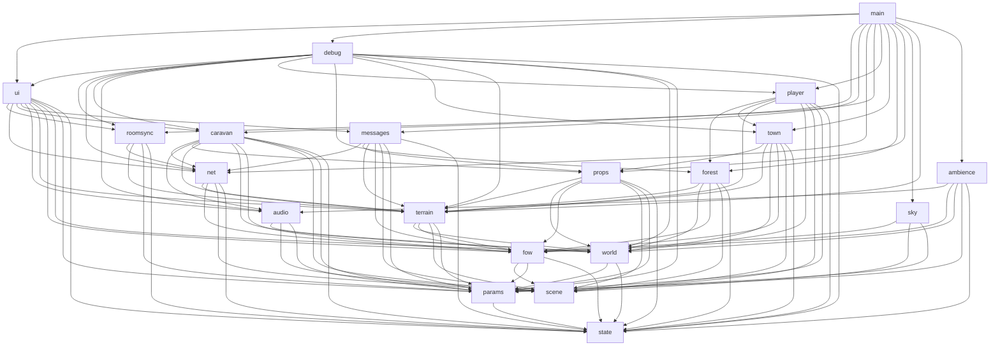

# Архитектура

Прототип — набор ES-модулей в `src/`, без сборщика: `index.html` содержит разметку и стили и подключает
`src/main.js` (`<script type="module">`); three.js приходит через importmap с unpkg, PeerJS — обычным `<script>`
(глобал `Peer`). Работает с любого статического сервера (GitHub Pages, `python3 -m http.server`); по `file://`
не откроется из-за модулей — это было так и до нарезки.

## Модули

| Модуль | За что отвечает | Экспортирует (главное) |
|---|---|---|
| `state.js` | «Дно» графа: комната `ROOM`, личность `ME`, seed и RNG мира (`rand`, `randCaravan`), `START_DIR`, `randomDir`, контейнер игрока `player`, часы `clock`. Никого не импортирует. | `ROOM, ME, PLAYER_COLOR, WORLD_SEED, rand, randCaravan, randomDir, START_DIR, player, clock, newId, hash32` |
| `params.js` | Схема панели, `DEFAULTS`, живой объект `P`, сохранение в localStorage, наборы `NET_LOCKED / NET_SHARED / NET_PERSONAL`, LWW-регистр комнаты `roomState`. | `SCHEMA, DEFAULTS, P, saveParams, roomState, sharedValues, applyRoomValues, saveRoomState` |
| `scene.js` | Renderer, `scene`, `camera`, свет, `resize`. | `renderer, scene, camera, sun` |
| `fow.js` | Туман войны и дымка: общие `fowUniforms`, GLSL-вставки, `fogify()` для любого материала, карта разведки, `updateFow()`. | `fogify, fowUniforms, FOW_FRAG_*, clearExplored, exploredPct, updateFow, SKY_COLOR, FOW_COLOR` |
| `world.js` | Разметка мира без мешей: где город (`townDir`, локальные оси, `townToDir/dirToTown`), оси биомов, озеро, CPU-шум, `biomeAt`. **Первый потребитель `rand()`.** | `townDir, townToDir, dirToTown, TOWN_*, BIOME, BIOME_NAME, biomeAt, biomeAtXYZ, lakeDir, LAKE_R, bioAxis, lakeAngle, fbm3` |
| `terrain.js` | Рельеф `terrainH/surfaceR`, геометрия стенки и воды, плитка × карта биомов, `paintBiomes()`, `applyRadius()` и реестр `radiusListeners`. | `terrainH, surfaceR, paintBiomes, applyRadius, radiusListeners, sphere, water` |
| `sky.js` | Сфера-атмосфера с облаками и солнцем, `updateSky()`. | `sky, updateSky` |
| `props.js` | Реестр объектов на стенке (`addProp/placeOnWall`), палитра, `buildProps()` — цветные коробки и маяки. | `props, addProp, placeOnWall, palette, buildProps` |
| `forest.js` | Ёлки инстансами: `buildForest()`, `placeTrees()`, массив `trees` для коллизий. | `trees, buildForest, placeTrees` |
| `town.js` | Дома, стена, ворота, башни: `buildTown()`, AABB-препятствия. | `townObstacles, buildTown` |
| `player.js` | Ввод (клавиатура, мышь), ходьба, прыжок, коллизии с городом и ёлками, удержание на рельефе, камера. Пишет `state.player`. | `updatePlayer, setPitch` |
| `messages.js` | Шары-сообщения и таблички (G-Set), форма чата, бросок по клику, сеть: `ball`, `plaque`, поле `plaques` в `hello`. | `plaques, loadPlaques, updateMessages` |
| `audio.js` | Ядро Web Audio: контекст, шины, `initAudio()`, хук `onAudioReady`, звуки каравана (`sfxBell/Thud/Grunt`). | `audio (live), initAudio, onAudioReady, sfxBell, sfxThud, sfxGrunt` |
| `ambience.js` | Птицы, звери, листва; хиджаз, дарбука, кухня; `updateAmbience()`. | `updateAmbience` |
| `caravan.js` | Верблюды и погонщики, `buildCaravan()`, детерминированная симуляция по мировому времени (`worldT0`, `stepCaravan`), `updateCaravan()`; сеть: поле `t0` в `hello`. | `caravan, buildCaravan, updateCaravan, worldT0 (live)` |
| `net.js` | PeerJS: слоты, mesh-соединения, аватары чужих игроков, `pos` 12 Гц. **Шина протокола**: `onNet(type, fn)`, `addHelloFields(fn)`, `onNetChange(fn)`. Игровой логики не знает. | `net, netStart, netBroadcast, netStatus, sendHello, onNet, addHelloFields, onNetChange, updateNet` |
| `roomsync.js` | Владелец комнаты и общие параметры: `isOwner`, `publishRoomParams`, приём `params`/`hello.room`, хук `onRoomChange`. | `isOwner, ownerName, publishRoomParams, onRoomChange` |
| `ui.js` | Весь DOM: панель параметров (`setParam`, блокировка у не-владельцев), блок сети, оверлей/захват мыши, HUD. | `setParam, updateHud` |
| `debug.js` | `window.dbg` при `?debug`: телепорты, доступ к состоянию. | `installDebug` |
| `main.js` | Порядок сборки мира и `tick()`. | — |

## Граф зависимостей

Стрелка `A --> B` = «A импортирует B». Циклов нет: там, где они напрашивались, стоят реестры/хуки
(`radiusListeners`, `onNet`, `onAudioReady`, `onRoomChange`, `onNetChange`).



Слои сверху вниз: **оркестрация** (`main`, `debug`) → **UI и сетевые надстройки** (`ui`, `roomsync`) →
**игровая логика** (`player`, `messages`, `caravan`, `ambience`) → **транспорт и звук** (`net`, `audio`) →
**мир** (`town`, `forest`, `props`, `sky`, `terrain`, `world`) → **основа** (`fow`, `scene`, `params`, `state`).

## Состояние: кто владеет, кто пишет

| Состояние | Живёт в | Пишут | Читают |
|---|---|---|---|
| `P` — параметры | `params` | `ui.setParam`, `roomsync` (применяет чужие), `params` (загрузка) | все, каждый кадр |
| `roomState {ver, owner, values}` | `params` | `roomsync`, `ui` (создание комнаты — в localStorage) | `roomsync`, `ui`, `debug` |
| `player {pos, forward, pitch, jumpH, jumpV, biome, groundH}` | `state` | `player` (кадр), `debug` (телепорт) | `net`, `fow`, `messages`, `caravan`, `ambience`, `ui` |
| `fowUniforms` (в т.ч. `uPlayerDir`, `uTime`) | `fow` | `fow.updateFow` | все материалы, `ambience`, `ui` (HUD) |
| `props[]`, `townObjects[]`, `trees[]` | `props`, `town`, `forest` | свои модули при сборке | `terrain.applyRadius` через `radiusListeners`, `player` (коллизии) |
| `plaques[]`, `plaqueIds` | `messages` | `messages` (свои, из сети, из localStorage) | `ui` (HUD) |
| `caravan {dir, tan, s, trail, camels, herders, simT}` | `caravan` | `caravan.stepCaravan` | `ui` (HUD), `debug` |
| `worldT0` | `caravan` | `caravan` (localStorage, `hello.t0`) | `caravan`, `debug` |
| `net {peer, slot, conns, remotes, status}` | `net` | `net` | `roomsync`, `ui`, `messages` (цвет чужого шара) |
| `audio {ctx, bus, …}` | `audio` | `audio.initAudio` | `caravan`, `ambience`, `debug` |

Правило: экспортируемые `let` (`audio`, `worldT0`, `exploredPct`) — живые привязки, снаружи только читаются;
всё, что пишут несколько модулей, лежит в объектах-контейнерах (`player`, `P`, `roomState`, `net`, `caravan`).

## Инициализация (main.js)

Часть модулей делает работу при импорте (создаёт рендерер, меши сферы/воды/неба, вешает слушатели событий и
подписки на сеть) — это безопасно, потому что не тратит `rand()`. Всё, что тратит `rand()`, вызывается явно
и строго в этом порядке, иначе комната с тем же seed получит другой мир:

1. импорт `world.js` — `townDir` (первый `rand()`)
2. `paintBiomes()` — карта биомов (без `rand`)
3. `buildForest()` — ёлки
4. `buildProps()` — цветные коробки, маяки
5. `buildTown()` — дома, стена, ворота
6. `applyRadius()` — геометрия стенки и воды под текущие `R`/`TERRAIN_H`, расстановка всего через `radiusListeners`
7. `buildCaravan()` — верблюды и погонщики
8. `loadPlaques()` — таблички комнаты из localStorage
9. `netStart()` — занять слот PeerJS, соединиться
10. `installDebug()` — `window.dbg` при `?debug`
11. `tick()`

Проверка эквивалентности после нарезки: старая (монолитная) и новая версии в одной комнате дают побитово
одинаковые `townDir`, все 750 ёлок, 60 препятствий, параметры верблюдов и погонщиков, рельеф и биомы;
караван у обеих в одной точке.

## Кадр: `tick()`

```
dt = min(clock.getDelta(), 0.05)
updatePlayer(dt)         player     базис (up = −normalize(pos), forward в касательной плоскости), WASD, коллизии
                                    с городом и ёлками, биом под ногами, прыжок, pos.setLength(R − h − EYE − jumpH),
                                    камера = basis(right, up, −forward) + pitch
updateMessages(dt)       messages   шары: гравитация от центра, приземление → landBall → табличка (+ сеть);
                                    таблички поворачиваются к игроку
updateCaravan()          caravan    догнать worldTime() шагами по 50 мс (stepCaravan — детерминированно),
                                    поставить верблюдов по следу, погонщиков сбоку, анимация, колокольчики/шаги/ворчание
updateAmbience()         ambience   громкость шин леса/города, планирование птиц, зверей, музыки, кухни
updateNet(dt)            net        своя pos ~12 Гц; чужие аватары — интерполяция и постановка на поверхность
updateSky()              sky        радиус R − SKY_H, облачность
updateFow(elapsed)       fow        дымка (fog.near/far), униформы тумана войны, uPlayerDir, отметка разведанного,
                                    процент разведки раз в 60 кадров → возвращает fowOn
updateHud(fowOn)         ui         строка HUD
renderer.render(scene, camera)
```

Порядок важен в двух местах: `updateAmbience` и `updateHud` читают `fowUniforms.uPlayerDir` — у ambience это
значение предыдущего кадра (как и было в монолите), у HUD — уже текущее.

## Сеть: шина в `net.js`

`net.js` знает только про слоты, соединения, `hello`-базу (id, имя, цвет) и `pos`. Остальное — подписки:

| Модуль | Добавляет в `hello` | Обрабатывает |
|---|---|---|
| `messages` | `plaques` (весь G-Set) | `hello` (слияние табличек), `ball`, `plaque` |
| `caravan` | `t0` | `hello` (переход на более ранний `worldT0`) |
| `roomsync` | `room` (LWW-регистр) | `hello` (`room`), `params` |
| `ui` | — | `onNetChange` → перерисовать блок сети |

Порядок обработки входящего `hello`: сначала `net` создаёт/обновляет аватар (`upsertRemote`), затем подписчики,
затем `netStatus('')` → перерисовка UI.

## Смена радиуса / рельефа

`terrain.applyRadius()` пересобирает геометрию сферы и воды, обновляет камеру и солнце, затем вызывает
`radiusListeners` — их регистрируют `props` (все `addProp`, включая таблички), `town`, `forest`. Вызывается
при старте, из `ui.setParam` (`R`, `TERRAIN_H`), из «Сброса» и из `roomsync` при получении чужих параметров.
