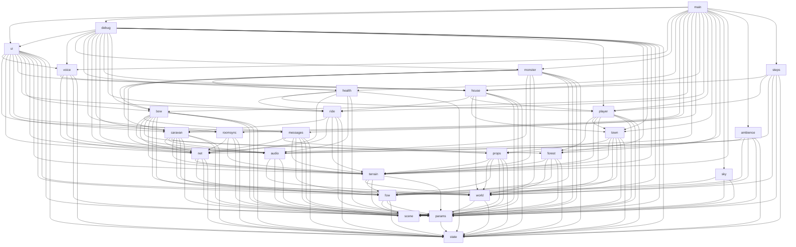

# Архитектура

Прототип — набор ES-модулей в `src/`, без сборщика: `index.html` содержит разметку и стили и подключает
`src/main.js` (`<script type="module">`); three.js приходит через importmap с unpkg, PeerJS — обычным `<script>`
(глобал `Peer`). Работает с любого статического сервера (GitHub Pages, `python3 -m http.server`); по `file://`
не откроется из-за модулей — это было так и до нарезки.

## Модули

| Модуль | За что отвечает | Экспортирует (главное) |
|---|---|---|
| `state.js` | «Дно» графа: комната `ROOM`, личность `ME`, seed и RNG мира (`rand`, `randCaravan`), `START_DIR`, `randomDir`, контейнер игрока `player`, часы `clock`, цвет игрока (`PLAYER_COLOR` — один изменяемый `THREE.Color`, `setPlayerColor` сохраняет выбор в `ME.color` и зовёт подписчиков `onPlayerColor`). Никого не импортирует. | `ROOM, ME, PLAYER_COLOR, setPlayerColor, onPlayerColor, WORLD_SEED, rand, randCaravan, randomDir, START_DIR, player, clock, newId, hash32` |
| `params.js` | Схема панели, `DEFAULTS`, живой объект `P`, сохранение в localStorage, наборы `NET_LOCKED / NET_SHARED / NET_PERSONAL`, LWW-регистр комнаты `roomState`. | `SCHEMA, DEFAULTS, P, saveParams, roomState, sharedValues, applyRoomValues, saveRoomState` |
| `scene.js` | Renderer, `scene`, `camera`, свет, `resize`. | `renderer, scene, camera, sun` |
| `fow.js` | Туман войны и дымка: общие `fowUniforms`, GLSL-вставки, `fogify()` для любого материала, карта разведки, `updateFow()`. | `fogify, fowUniforms, FOW_FRAG_*, clearExplored, exploredPct, updateFow, SKY_COLOR, FOW_COLOR` |
| `world.js` | Разметка мира без мешей: где город (`townDir`, локальные оси, `townToDir/dirToTown`), оси биомов, озеро, CPU-шум, `biomeAt`. **Первый потребитель `rand()`.** | `townDir, townToDir, dirToTown, TOWN_*, BIOME, BIOME_NAME, biomeAt, biomeAtXYZ, lakeDir, LAKE_R, bioAxis, lakeAngle, fbm3` |
| `terrain.js` | Рельеф `terrainH/surfaceR`, геометрия стенки и воды, плитка × карта биомов, `paintBiomes()`, `applyRadius()` и реестр `radiusListeners`. | `terrainH, surfaceR, paintBiomes, applyRadius, radiusListeners, sphere, water` |
| `sky.js` | Сфера-атмосфера с облаками и солнцем, `updateSky()`. | `sky, updateSky` |
| `props.js` | Реестр объектов на стенке (`addProp/placeOnWall`), палитра, `buildProps()` — цветные коробки и маяки. | `props, addProp, placeOnWall, palette, buildProps` |
| `forest.js` | Ёлки инстансами: `buildForest()`, `placeTrees()`, массив `trees` для коллизий. | `trees, buildForest, placeTrees` |
| `town.js` | Дома, стена, ворота, башни: `buildTown()`, AABB-препятствия; метаданные домов `houses[]` (размеры, поворот, дверь, балконы) и площадки балконов `townPlatforms[]`, на которых можно стоять. | `townObstacles, houses, townPlatforms, buildTown, houseLocalToTown, houseDoorNear, townPlatformAt` |
| `house.js` | Интерьеры: отдельная сцена `houseScene` с плоским полом, генератор дома из seed+номер (этажи, лестница, перегородки, мебель, обои, «особенность»), контроллер ходьбы внутри (перехватывает управление через `setPlayerOverride`), вход/выход через дверь и балконы (`onSpace`). | `houseScene, house {active, hint}, updateHouse, debugEnter, debugExit` |
| `player.js` | Ввод (клавиатура, мышь), ходьба, прыжок, коллизии с городом и ёлками, удержание на рельефе и на балконных площадках, камера. Пишет `state.player`. Точки расширения: `onSpace(fn)` — перехват пробела, `setPlayerOverride({update, mouse, jump})` — отдать управление другому контроллеру. | `updatePlayer, setPitch, onSpace, setPlayerOverride, keys, townXZ, nearTown, platform` |
| `messages.js` | Шары-сообщения и таблички (G-Set), форма чата, бросок по клику, сеть: `ball`, `plaque`, поле `plaques` в `hello`. `holding()` — шар в руке (тогда клик бросает, а не стреляет). | `plaques, holding, loadPlaques, updateMessages` |
| `bow.js` | Лук в лесу (место из seed'а, свой RNG), подбор вплотную (запоминается в localStorage комнаты), лук в руке (ребёнок камеры), стрелы: клик без шара → полёт по дуге (`P.ARROW_SPEED`, `P.GRAVITY`), след, втыкание в землю (остаются, FIFO 300); сеть: `arrow {p, v, color}`. Хук `onArrowHit(fn(from, to, arrow))` — проверка попадания по отрезку полёта за кадр (`true` — стрела поглощена). | `bow {have, hint, dir}, arrows, buildBow, updateBow, onArrowHit` |
| `health.js` | HP игрока (100), урон `damagePlayer`, лечение 8 HP/с после 6 с без урона, смерть (управление замирает через `setPlayerOverride`, верблюд отпускается) и через 4 с возрождение на старте; полоска `#hp`, вспышка `#hurt`, экран `#dead`; флаг `dd` в `pos`. | `HP_MAX, health, damagePlayer, updateHealth` |
| `monster.js` | Медведракон: модель, ИИ (бродит у центра леса, провожает караван, гонится, возвращается), скорпионы, скелеты, попадания стрел (`onArrowHit`), укусы (`damagePlayer`), звуки, полоса босса `#boss`. Симулирует один хозяин комнаты; сеть: `mon` (снимок), `mhit` (попадание), `mon` в `hello`. | `monster, MON_HP, isMonsterHost, updateMonster, monsterView, debugMonsterHit` |
| `audio.js` | Ядро Web Audio: контекст, шины, `initAudio()`, хук `onAudioReady`, звуки каравана (`sfxBell/Thud/Grunt`), тетива (`sfxTwang`). Поправка `THREE.AudioListener`: «верх» слушателя поворачивается вместе с камерой (иначе на сфере лево/право путаются с верхом). | `audio (live), initAudio, onAudioReady, sfxBell, sfxThud, sfxGrunt, sfxTwang` |
| `voice.js` | Голос: media-звонок PeerJS на каждую пару (звонит больший слот), тишина вместо микрофона до включения (`replaceTrack`), `M`/кнопка — микрофон; у получателя `PannerNode` (equalpower, моно, линейно до `P.VOICE_R`) у рта аватара, в доме — только из того же дома (поле `hi` в `pos`); значок «говорит», подсветка в блоке сети. | `voice, toggleMic, updateVoice, debugVoiceTone, debugVoiceLevels` |
| `ambience.js` | Птицы, звери, листва; хиджаз, дарбука, кухня; `updateAmbience()`. | `updateAmbience` |
| `steps.js` | Шаги: каденс по пройденному пути (снаружи — `player.pos`, в доме — `house.active.pos`), покрытие (биом, мостовая города, дерево балкона/дома), синтез в `audio.selfBus`, `P.STEPS`. | `updateSteps` |
| `caravan.js` | Верблюды и погонщики, `buildCaravan()`, детерминированная симуляция по мировому времени (`worldT0`, `stepCaravan`), `updateCaravan()`; сеть: поле `t0` в `hello`. `camelSlotDir(i)` — где сейчас место верблюда `i` в цепочке. | `caravan, buildCaravan, updateCaravan, camelSlotDir, worldT0 (live)` |
| `ride.js` | Верблюд под седлом: приручение (полоска, `P.TAME_T`), посадка (`player.rideH`, `player.speedBonus = P.RIDE_BONUS`), E — слезть, бег верблюда обратно в цепочку, чужие седоки; сеть: `camel` {ride/back}, поле `c` в `pos`, `camel` в `hello`. Переставляет верблюдов, ушедших из цепочки, **после** `updateCaravan` и `updateNet`. `forceDismount()` — ссадить (гибель игрока). | `ride {camel, target, progress, hint}, camelRider, updateRide, forceDismount` |
| `net.js` | PeerJS: слоты, mesh-соединения, аватары чужих игроков, `pos` 12 Гц. **Шина протокола**: `onNet(type, fn)`, `addHelloFields(fn)`, `addPosFields(fn)`, `onNetChange(fn)`. Игровой логики не знает. У каждого remote хранится последний `pos` целиком (`r.last`) — для полей других модулей. | `net, netStart, netBroadcast, netStatus, sendHello, onNet, addHelloFields, addPosFields, onNetChange, updateNet, slotId, slotOf` |
| `roomsync.js` | Владелец комнаты и общие параметры: `isOwner`, `publishRoomParams`, приём `params`/`hello.room`, хук `onRoomChange`. | `isOwner, ownerName, publishRoomParams, onRoomChange` |
| `ui.js` | Весь DOM: панель параметров (`setParam`, блокировка у не-владельцев), блок сети, оверлей/захват мыши, HUD. | `setParam, updateHud` |
| `debug.js` | `window.dbg` при `?debug`: телепорты, доступ к состоянию. | `installDebug` |
| `main.js` | Порядок сборки мира и `tick()`. | — |

## Граф зависимостей

Стрелка `A --> B` = «A импортирует B». Циклов нет: там, где они напрашивались, стоят реестры/хуки
(`radiusListeners`, `onNet`, `onAudioReady`, `onRoomChange`, `onNetChange`).



Слои сверху вниз: **оркестрация** (`main`, `debug`) → **UI и сетевые надстройки** (`ui`, `roomsync`) →
**игровая логика** (`voice`, `monster`, `health`, `player`, `house`, `ride`, `messages`, `bow`, `caravan`, `ambience`, `steps`) → **транспорт и звук** (`net`, `audio`) →
**мир** (`town`, `forest`, `props`, `sky`, `terrain`, `world`) → **основа** (`fow`, `scene`, `params`, `state`).

## Состояние: кто владеет, кто пишет

| Состояние | Живёт в | Пишут | Читают |
|---|---|---|---|
| `PLAYER_COLOR`, `ME.color` | `state` | `ui` (поле выбора цвета → `setPlayerColor`) | `messages` (шар в руке — через `onPlayerColor`, рамка таблички и `ball` — в момент броска), `bow` (перья, `arrow`), `net` (`hello.color`; у получателя аватар пересобирается на месте), `ui` |
| `P` — параметры | `params` | `ui.setParam`, `roomsync` (применяет чужие), `params` (загрузка) | все, каждый кадр |
| `roomState {ver, owner, values}` | `params` | `roomsync`, `ui` (создание комнаты — в localStorage) | `roomsync`, `ui`, `debug` |
| `player {pos, forward, pitch, jumpH, jumpV, biome, groundH, inside, rideH, speedBonus, dead}` | `state` | `player` (кадр), `house` (вход/выход: `inside`, позиция при выходе), `ride` (`rideH`, `speedBonus` при посадке/спуске), `health` (`dead`, позиция при возрождении), `debug` (телепорт) | `net` (флаг `in`, `j = jumpH + rideH` в `pos`), `fow`, `messages` (внутри не бросаем), `bow` и `player` (мёртвый не стреляет и не прыгает), `monster` (цель), `caravan`, `ambience`, `ui`, `main` (какую сцену рендерить) |
| `voice {mic, micTrack, error, level, peers: slot → {call, conn, nodes, …}}` | `voice` | `voice` (звонки, `toggleMic`, кадр) | `ui` (кнопка микрофона), `debug` |
| `health {hp, dead, deadT, lastHit, by}` | `health` | `health` (`damagePlayer` — зовёт `monster` при укусе своего игрока) | `monster` (мёртвый — не цель), `debug` |
| `monster {gen, dir, fwd, hp, st, tgt, spawned, respawnAt, scorps[], skeletons[], …}` | `monster` | хозяин — `simulate`; остальные — `adopt` снимка | `monster` (вид, укусы, попадания), `debug` |
| `house.active {h, it, pos, yaw, pitch, vy, grounded}`, `house.hint` | `house` | `house` (контроллер) | `ui` (HUD), `debug` |
| `ride {camel, target, progress, hint}`, `caravan.camels[i].st {rider, away, dir, seen}` | `ride` | `ride` (кадр, клавиша E, сеть) | `ui` (полоска приручения, HUD), `house` (не пускать верхом), `debug` |
| `bow {have, hint, dir}`, `arrows {flying, stuck}` | `bow` | `bow` (подбор, клик, сеть, localStorage) | `ui` (HUD), `debug` |
| `houses[]`, `townPlatforms[]` | `town` | `town` при сборке | `house` (интерьер, точки выхода), `player` (стоять на балконе), `debug` |
| `fowUniforms` (в т.ч. `uPlayerDir`, `uTime`) | `fow` | `fow.updateFow` | все материалы, `ambience`, `ui` (HUD) |
| `props[]`, `townObjects[]`, `trees[]` | `props`, `town`, `forest` | свои модули при сборке | `terrain.applyRadius` через `radiusListeners`, `player` (коллизии) |
| `plaques[]`, `plaqueIds` | `messages` | `messages` (свои, из сети, из localStorage) | `ui` (HUD) |
| `caravan {dir, tan, s, trail, camels, herders, simT}` | `caravan` | `caravan.stepCaravan` | `ui` (HUD), `debug` |
| `worldT0` | `caravan` | `caravan` (localStorage, `hello.t0`) | `caravan`, `debug` |
| `net {peer, slot, conns, remotes, status}` | `net` | `net` | `roomsync`, `ui`, `messages` (цвет чужого шара) |
| `audio {ctx, bus, selfBus, …}` | `audio` | `audio.initAudio` | `caravan`, `ambience`, `bow` (тетива), `steps`, `debug` |

Правило: экспортируемые `let` (`audio`, `worldT0`, `exploredPct`) — живые привязки, снаружи только читаются;
всё, что пишут несколько модулей, лежит в объектах-контейнерах (`player`, `P`, `roomState`, `net`, `caravan`).

## Инициализация (main.js)

Часть модулей делает работу при импорте (создаёт рендерер, меши сферы/воды/неба, вешает слушатели событий и
подписки на сеть) — это безопасно, потому что не тратит `rand()`. Всё, что тратит `rand()`, вызывается явно
и строго в этом порядке, иначе комната с тем же seed получит другой мир:

1. импорт `world.js` — `townDir` (первый `rand()`)
2. `paintBiomes()` — карта биомов (без `rand`)
3. `buildForest()` — ёлки
4. `buildProps()` — цветные коробки, маяки
5. `buildTown()` — дома, стена, ворота
6. `applyRadius()` — геометрия стенки и воды под текущие `R`/`TERRAIN_H`, расстановка всего через `radiusListeners`
7. `buildCaravan()` — верблюды и погонщики
8. `buildBow()` — лук в лесу (свой RNG, `rand()` не тратит; нужны `trees`, чтобы не лечь в ствол)
9. `loadPlaques()` — таблички комнаты из localStorage
10. `netStart()` — занять слот PeerJS, соединиться
11. `installDebug()` — `window.dbg` при `?debug`
12. `tick()`

Проверка эквивалентности после нарезки: старая (монолитная) и новая версии в одной комнате дают побитово
одинаковые `townDir`, все 750 ёлок, 60 препятствий, параметры верблюдов и погонщиков, рельеф и биомы;
караван у обеих в одной точке.

## Кадр: `tick()`

```
dt = min(clock.getDelta(), 0.05)
updatePlayer(dt)         player     базис (up = −normalize(pos), forward в касательной плоскости), WASD, коллизии
                                    с городом и ёлками, биом под ногами, прыжок, pos.setLength(R − h − EYE − jumpH),
                                    прилипание к балконной площадке (townPlatformAt), камера = basis(right, up, −forward) + pitch.
                                    Если стоит override (игрок в доме) — вместо всего этого house.controller.update(dt):
                                    плоская гравитация, круг-vs-AABB, пол/лестница через groundAt, камера YXZ(pitch, yaw)
updateHouse()            house      подсказка «пробел — войти/выйти» (у двери, на балконе снаружи; у выходов внутри)
updateMessages(dt)       messages   шары: гравитация от центра, приземление → landBall → табличка (+ сеть);
                                    таблички поворачиваются к игроку
updateBow(dt)            bow        лук в лесу (покачивание, подбор в 1,8 м), стрелы: gravity к стенке, нос по скорости,
                                    след по скорости, наконечник достиг surfaceR → воткнулась (в stuck, FIFO 300)
updateCaravan()          caravan    догнать worldTime() шагами по 50 мс (stepCaravan — детерминированно),
                                    поставить верблюдов по следу, погонщиков сбоку, анимация, колокольчики/шаги/ворчание
updateAmbience()         ambience   громкость шин леса/города, планирование птиц, зверей, музыки, кухни
updateSteps(dt)          steps      путь за кадр → шаг по покрытию под ногами; приземление; телепорт/вход в дом — сброс
updateNet(dt)            net        своя pos ~12 Гц; чужие аватары — интерполяция и постановка на поверхность
updateRide(dt)           ride       приручение (progress ± dt), свой верблюд под ногами, чужие седоки (по r.last.c под
                                    их аватаром), пропавший седок → 'back', возвращение отпущенных к camelSlotDir(i).
                                    Стоит после updateCaravan (тот ставит всех верблюдов в цепочку) и updateNet (нужны свежие r.pos)
updateVoice(dt)          voice      панорама каждого собеседника — к рту его аватара (или к его точке в том же доме), гейт
                                    «не слышно», громкость голосов, значок «говорит», уровень своего микрофона на кнопке
updateMonster(dt)        monster    хозяин: ИИ монстра и скорпионов, снимок 'mon' 10 Гц; все: интерполяция к монстру, анимация,
                                    переходы (рёв, роды, смерть), укусы своего игрока, полоса босса. После updateRide — караван
                                    и чужие аватары уже на местах
updateHealth(dt)         health     лечение, отсчёт до возрождения, полоска HP, вспышка урона, экран смерти
updateSky()              sky        радиус R − SKY_H, облачность
updateFow(elapsed)       fow        дымка (fog.near/far), униформы тумана войны, uPlayerDir, отметка разведанного,
                                    процент разведки раз в 60 кадров → возвращает fowOn
updateHud(fowOn)         ui         строка HUD (внутри дома — номер дома, этаж, размер, подсказка), полоска приручения #tame
renderer.render(player.inside ? houseScene : scene, camera)
```

## Дома: вход, интерьер, выход

- **Снаружи.** `town.buildTown()` кладёт в `houses[]` для каждого дома `{x, z, yaw, w, d, floors, doorX, balconies}` и
  в `townPlatforms[]` AABB каждого балкона с высотой `f·3 + 0.16`. `player.updatePlayer` рядом с городом переводит
  позицию в координаты города (`townXZ`), берёт самую высокую площадку не выше себя (`townPlatformAt(x, z, jumpH)` —
  балконы этажей стоят друг над другом) и, если игрок опускается на неё, «прилипает»
  (`jumpH = plat.h`, `platform = plat`), так что на балконе можно стоять и прыгать.
- **Пробел.** `player` сначала отдаёт пробел обработчикам `onSpace`; `house` возвращает `true`, если что-то
  сделал (вошёл/вышел), иначе обычный прыжок. У двери (`houseDoorNear`) — вход на 1 этаж; стоя на площадке
  балкона — вход на этаж балкона; внутри у двери/балконной двери — выход.
- **Внутри.** Интерьер строится один раз на дом (`built`) собственным RNG `mulberry32(WORLD_SEED ^ hash32('house:'+idx))`,
  поэтому `rand()` мира не тратится и у всех в комнате интерьеры одинаковые. Размер внутри — снаружи × 1.7–2.6
  по каждой оси (у каждого дома свой), этаж 3.2 м, лестницы вдоль боковых стен с площадкой 1.6 м перед первой
  ступенью — этажи чередуют стену (1→2 у левой, 2→3 у правой), иначе вторая лестница встала бы над проёмом первой
  (`stairGeo(f)`). Перегородки с проёмами 1.4 м, мебель ставится rejection sampling с гарантией зазора ≥ 1 м между
  любыми препятствиями (игрок — круг ⌀0.7), у стен — либо вплотную, либо ≥ 1 м. Запретные зоны (`roomZones`): подходы
  к выходам, к лестнице снизу и сверху, проёмы перегородок; полосы вдоль лестницы и вдоль проёма (`xMin/xMax`).
- **Сцена.** Пока `player.inside`, `main` рендерит `houseScene` (в ней ровно один интерьер — `shown`), мир при этом
  живёт: сеть, караван, таблички обновляются. В `pos` уходит флаг `in`, по нему у остальных аватар скрывается.
  Камера — ребёнок мировой `scene`, поэтому контроллер сам зовёт `camera.updateMatrixWorld()`.
- **Выход.** `exitToWorld(h, lx, lz, jumpH)`: локальные координаты дома → город (`houseLocalToTown`) → направление
  на сфере (`townToDir`), `player.pos` на нужной высоте, `forward` от фасада; при выходе на балкон `jumpH = f·3 + 0.16`
  и `updatePlayer` на следующем кадре находит площадку.

Порядок важен в двух местах: `updateAmbience` и `updateHud` читают `fowUniforms.uPlayerDir` — у ambience это
значение предыдущего кадра (как и было в монолите), у HUD — уже текущее.

## Верблюд под седлом (`ride.js`)

- **Приручение.** Каждый кадр ищется ближайший верблюд *цепочки* (`st.away === null`) в 2,8 м по дуге. Пока он есть —
  `ride.progress += dt` (полоска `#tame` в `ui`), отошёл — `−3·dt`. `progress ≥ P.TAME_T` → `mount(i)`.
- **Посадка.** `st = {rider: ME.id, away: 'ride'}`, `player.rideH = 1.8` (глаза над горбами), `player.speedBonus = P.RIDE_BONUS`.
  `updateCaravan` по-прежнему ставит всех верблюдов по следу, а `updateRide` следом переставляет ушедших: своего — под
  `player.pos` лицом по `forward`, чужих — под `r.pos`/`r.fwd` тех remote, у кого в последнем `pos` есть `c`.
  Ноги анимируются по фактической скорости. Место в цепочке пустует (остальные не сдвигаются).
- **E — слезть.** `st.away = 'back'`, `st.dir` = точка спуска; верблюд идёт по дуге большого круга к `camelSlotDir(i)`
  (место, где он должен быть *сейчас*) со скоростью `SPEED + 4` м/с; дойдя — `away = null`, и его снова ведёт `updateCaravan`.
- **В дом верхом нельзя.** `house.onSpace` при `ride.camel >= 0` возвращает `false` (обычный прыжок), подсказка
  «слезьте (E)».
- **Сеть.** `camel {i, s:'ride', by}` и `camel {i, s:'back', d}` при посадке/спуске; `c` (номер верблюда) в каждом `pos`;
  `camel` в `hello` — опоздавший сразу видит, кто на ком. Конфликт (двое сели одновременно на одного): при `claimed`
  своим верблюдом уступает тот, у кого id больше (`dismount(false)`). Седок, от которого 6 с нет `pos` (вышел),
  считается пропавшим — верблюд сам бежит назад.
- **Детерминизм.** Караван по-прежнему симулируется по мировому времени; состояние седла — только сетевое, `rand()`
  не тратится. Верблюдов в караване 5–7 (комната — до 5 игроков, каждому хватит).

## Лук и стрелы (`bow.js`)

- **Где лежит.** `buildBow()` — rejection sampling своим RNG `mulberry32(WORLD_SEED ^ hash32('bow'))`: биом лес, не ближе
  40 м к старту, не ближе 1,5 м к стволу. Стоит над землёй, покачивается и вращается, над ним столб мягкого света
  (additive) — среди ёлок иначе не найти. У всех в комнате лук в одной точке.
- **Подбор.** В 1,8 м по дуге (не в доме) — `bow.have = true`, лук появляется в левой руке (ребёнок камеры, в доме не
  рендерится, т.к. `houseScene`), находка пишется в `localStorage` (`inner-sphere-bow-<room|solo>`). У каждого игрока
  свой экземпляр: лук в лесу остаётся для остальных. Подсказка «Лук!» — в 12 м.
- **Клик.** `mousedown` на канвасе с `capture: true` — проверить `messages.holding()` **до** того, как `messages.js`
  бросит шар и опустошит руку; иначе один клик и бросал бы, и стрелял. Стреляем, если лук есть, шара нет, не в доме,
  прошло ≥ 0,35 с. Стрела: из точки камеры +0,8 м по взгляду, `v = dir · P.ARROW_SPEED`, `sfxTwang`, `arrow` в сеть.
- **Полёт.** Как у шаров: `vel += normalize(pos) · P.GRAVITY · dt`, нос по скорости, след — усечённый конус за
  хвостовиком длиной `min(4, |v|·0.05)`. Внутри сферы «ровный» выстрел падает быстро (стенка сама загибается навстречу):
  при 60 м/с и R=80 — 0° ≈ 12 м, 20° ≈ 30 м, 45° ≈ 90 м, 77° ≈ 150 м; до антипода (250 м) не долетает.
- **Приземление.** Когда радиальная координата наконечника ≥ `surfaceR(dir)`: стрела сдвигается назад по своему
  направлению так, чтобы наконечник ушёл в землю на ~0,25 м, след гасится, стрела переходит в `stuck` (FIFO 300, старые
  убираются). Стрелы не переставляются при смене `R` (эфемерны) и не сохраняются между сессиями.

## Монстр (`monster.js`, `health.js`)

- **Хозяин.** Монстра и скорпионов симулирует один игрок — синхронизированный с наименьшим слотом (в одиночной игре —
  ты), `isMonsterHost()`. Он рассылает снимок `mon` 10 Гц: `{g, d, f, hp, st, tg, sp, rs, sc: [[id, x, y, z, hp]], sk}`
  (`g` — поколение монстра, `rs` — сколько мс до нового). Остальные принимают снимки **только от хозяина** и плавно
  тянут к ним свои копии; переходы состояния (`chase`, роды, `dead`) определяют сами по смене `st`/`sp` — отсюда рёв,
  роды и падение у всех.
- **Синхронизация новичка.** Вошедший в комнату `synced = false`: не симулирует и не шлёт `mon`, пока не примет чужой
  снимок (он есть в `hello` каждого синхронизированного) или не пробудет 6 с один. Без этого новичок, занявший слот 0,
  стал бы хозяином со свежим монстром и сбросил бы идущий бой. Первый принятый снимок — «тихий» (без рёва и падения).
  Ушёл хозяин — хозяином становится следующий по слоту и продолжает с последнего принятого снимка.
- **Попадания.** Стрелы проверяет каждый клиент у себя через `bow.onArrowHit` (отрезок полёта за кадр против сфер:
  голова — 2 урона, туловище — 1, скорпион — 1), но засчитывает только свои (`arrow.own`): хозяин применяет сразу,
  остальные шлют ему `mhit`. Чужие стрелы просто исчезают в теле. Стрелок в 57 м от монстра становится его целью.
- **Укусы.** Решает укушенный: каждый клиент по своей копии монстра/скорпионов проверяет дистанцию до себя и зовёт
  `damagePlayer`. Лежащего мёртвым (`dd` в `pos`) и сидящего в доме монстр не преследует.
- **Лес.** Шаг монстра, уводящий из леса (`biomeAt !== FOREST`), не делается — пробуются повороты на ±0,5 и ±1,1 рад.
  Скорпионы ограничения не имеют.
- **Скелеты** — список направлений в снимке (до 8), ставятся после анимации падения и переставляются при смене `R`
  (`radiusListeners`).

## Голос (`voice.js`)

- **Звонки.** На каждую пару — отдельный `MediaConnection` PeerJS рядом с каналом данных; звонит больший слот, как и в
  данных. Звонки начинаются, когда запущен звук (первый клик): входящие до этого ждут в `pendingIn`. Звонок следует за
  каналом данных: канал пропал или сменился (собеседник перезагрузился), `connectionState` = `failed`/`closed` —
  звонок закрывается, больший слот перезванивает (`sync` при каждом `onNetChange` и раз в 3 с).
- **Микрофон.** В звонок сразу уходит трек тишины (`MediaStreamDestination`), поэтому соединение есть и без разрешения
  на микрофон. Включение — `getUserMedia` (эхо- и шумоподавление, АРУ) и `RTCRtpSender.replaceTrack` во всех звонках,
  без повторных переговоров; выключение — `track.enabled = false`.
- **Приём.** `MediaStreamSource → gain (гейт) → PannerNode → voiceBus → destination`, мимо общей громкости. Chrome отдаёт
  удалённый WebRTC-поток в Web Audio, только если он подключён к медиаэлементу, — держим немой `<audio>`. Панорама:
  `equalpower` (на колонках чёткое лево/право; HRTF давал ~6 дБ), вход сведён в моно (стерео-вход equalpower сбоку
  на 6 дБ громче), `linear` от 7 м до `P.VOICE_R`. Позиция — рот аватара; в доме — точка из поля `hi` того же дома
  (камера в доме стоит в координатах интерьера, мировые позиции там не годятся).
- **Слушатель.** `THREE.AudioListener` (ребёнок камеры) передаёт Web Audio «верх» из `listener.up` без поворота — это
  мировой +Y. На сфере это неверно почти везде, поэтому `audio.js` перед каждым обновлением слушателя кладёт в
  `listener.up` его настоящий мировой верх. Поправка касается и каравана, и города.

## Сеть: шина в `net.js`

`net.js` знает только про слоты, соединения, `hello`-базу (id, имя, цвет) и `pos`. Остальное — подписки:

| Модуль | Добавляет в `hello` | Добавляет в `pos` | Обрабатывает |
|---|---|---|---|
| `messages` | `plaques` (весь G-Set) | — | `hello` (слияние табличек), `ball`, `plaque` |
| `caravan` | `t0` | — | `hello` (переход на более ранний `worldT0`) |
| `ride` | `camel` | `c` | `hello` (`camel`), `camel` |
| `bow` | — | — | `arrow` (`{p, v, color}` → своя копия стрелы в полёте) |
| `monster` | `mon` (снимок, только у синхронизированных) | — | `hello` (`mon`), `mon` (снимок хозяина), `mhit` (`{k, id, n, by}` — хозяин применяет попадание) |
| `health` | — | `dd` (лежит мёртвый) | — |
| `voice` | — | `hi` (`[дом, x, y, z]` — где стоит в доме) | media-звонки PeerJS (`peer.on('call')`), не через шину |
| `roomsync` | `room` (LWW-регистр) | — | `hello` (`room`), `params` |
| `ui` | — | — | `onNetChange` → перерисовать блок сети |

Порядок обработки входящего `hello`: сначала `net` создаёт/обновляет аватар (`upsertRemote`), затем подписчики,
затем `netStatus('')` → перерисовка UI.

## Смена радиуса / рельефа

`terrain.applyRadius()` пересобирает геометрию сферы и воды, обновляет камеру и солнце, затем вызывает
`radiusListeners` — их регистрируют `props` (все `addProp`, включая таблички), `town`, `forest`. Вызывается
при старте, из `ui.setParam` (`R`, `TERRAIN_H`), из «Сброса» и из `roomsync` при получении чужих параметров.
